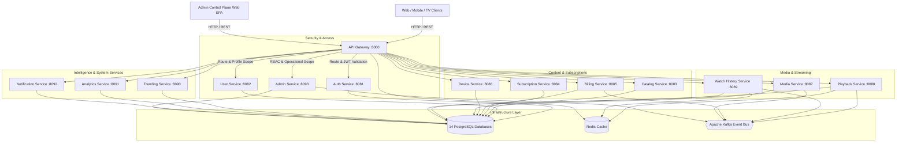

# StreamX: Event-Driven Microservices Video Streaming Platform


**StreamX** is an enterprise-grade, Netflix-inspired event-driven video streaming microservices platform built using **Java 24**, **Spring Boot 3.4**, **PostgreSQL**, **Redis**, **Apache Kafka**, **Docker**, **Kubernetes**, and a dedicated **Vite + React + TypeScript** Administrative Control Plane.

The platform features strict service isolation with independent per-service databases, dynamic data-driven subscription plans with decoupled entitlement resolution, profile-centric cross-device watch history sync, adaptive HTTP Live Streaming (HLS), velocity-based trending content calculation, real-time analytics aggregation, multi-channel notifications, fine-grained Role-Based Access Control (RBAC), immutable system audit logging, feature flag percentage rollouts, customer support ticket management, platform health monitoring, and centralized JWT security at the API Gateway.

---

## Monorepo Layout

```
streaming-system/
├── backend/                        # 16 Java 24 & Spring Boot 3.4 Microservice Modules
│   ├── admin-service/              # Central Operational Control Plane & Admin APIs (Port 8093)
│   ├── analytics-service/          # Real-time Analytics & Business Metrics Aggregation (Port 8091)
│   ├── api-gateway/                # Reactive API Gateway & JWT Filter (Port 8080)
│   ├── auth-service/               # Authentication, Account JWTs & OTP Verification (Port 8081)
│   ├── billing-service/            # Payment Processing, Status Tracking & Refund Control (Port 8085)
│   ├── catalog-service/            # Movies, TV Shows, Seasons, Episodes & Genres (Port 8083)
│   ├── common/                     # Shared DTOs, Security Constants & Audit Event Envelopes
│   ├── device-service/             # Device Fingerprinting & Registered Session Limits (Port 8086)
│   ├── media-service/              # Asset Ingestion & FFmpeg HLS Transcoding Pipeline (Port 8087)
│   ├── notification-service/       # Email & SMS Notification Engine (Port 8092)
│   ├── playback-service/           # Playback Authorization & Session Tokens (Port 8088)
│   ├── subscription-service/       # Plan Management, Immutable Versioning & Entitlements (Port 8084)
│   ├── trending-service/           # Velocity Score Intelligence & Top Content Calculation (Port 8090)
│   ├── user-service/               # Profile Management, Kids Mode & 4-Digit PIN Security (Port 8082)
│   ├── watch-history-service/      # Profile Watch State & "Continue Watching" Sync (Port 8089)
│   ├── docker-compose.yml          # Full Multi-Container Orchestration Manifest
│   ├── pom.xml                     # Parent Maven Project Configuration
│   └── scripts/                    # Database Initializer Scripts (init-db.sql)
├── apps/
│   ├── admin/                      # StreamX Admin Portal SPA (Vite 6, React 18, TypeScript, Tailwind)
│   └── mobile/                     # Upcoming StreamX Mobile & TV Client Application (Flutter)
├── k8s/                            # Production Kubernetes Deployment Manifests
└── .github/workflows/              # GitHub Actions CI/CD Pipeline Configuration
```

---

## Architecture Overview



---

## System Microservices Inventory

| Microservice | Port | Database | Primary Responsibility |
| :--- | :--- | :--- | :--- |
| **`common`** | N/A | None | Shared DTOs (`ApiResponse`, `EventEnvelope`), `JwtUtils`, exceptions, and `AdminRole` definitions. |
| **`auth-service`** | `8081` | `auth_db` | Account registration, authentication, JWT tokens, 6-digit hashed OTP phone verification. |
| **`user-service`** | `8082` | `user_db` | Profile management (Adult/Kids), 4-digit hashed PIN locking, profile-scoped token generation. |
| **`catalog-service`** | `8083` | `catalog_db` | Movies, TV Shows, Seasons, Episodes, Genres, and lifecycle status (`DRAFT` to `PUBLISHED`). |
| **`subscription-service`**| `8084` | `subscription_db` | Data-driven plan management, immutable plan versioning, decoupled entitlement resolution. |
| **`billing-service`** | `8085` | `billing_db` | Payment transaction processing via `PaymentProvider`, payment status tracking, and refunds. |
| **`device-service`** | `8086` | `device_db` | Device fingerprint registration, active session tracking, and max registered device enforcement. |
| **`media-service`** | `8087` | `media_db` | Asset ingestion, FFmpeg HLS transcoding (`.m3u8` master/variant playlists and `.ts` segments). |
| **`playback-service`** | `8088` | `playback_db` | Playback authorization, temporary stream token issuance, concurrent stream limits enforcement. |
| **`watch-history-service`**| `8089` | `watch_history_db` | Profile-centric progress synchronization, "Continue Watching" carousel, $\ge 90\%$ completion thresholding. |
| **`trending-service`** | `8090` | `trending_db` | Velocity scoring algorithm calculating real-time top trending catalog items. |
| **`analytics-service`** | `8091` | `analytics_db` | Aggregation of DAU, MAU, total watch time hours, completion rates, and platform revenue. |
| **`notification-service`** | `8092` | `notification_db` | Multi-channel user notifications (Email, SMS) for welcome, OTP, and payment alerts. |
| **`admin-service`** | `8093` | `admin_db` | Audit logging, feature flag percentage rollouts, incident center, ticket management, platform health. |
| **`api-gateway`** | `8080` | None | Central entrypoint with reactive `JwtAuthenticationFilter`, routing, and header enrichment. |

---

## Administrative Control Plane & RBAC Roles

The **StreamX Admin Portal** (`apps/admin`) is a single-page operational control platform following zero-gradient flat styling, Lucide icons, page-based navigation, and zero dummy/unbacked buttons.

### RBAC Roles Matrix

1. **`SUPER_ADMIN`**: Unrestricted access across all operational modules, security settings, role assignments, emergency platform operations, and maintenance mode controls.
2. **`ADMIN`**: Operational platform administration covering accounts, suspension/blocking, content management, device management, and notifications.
3. **`CONTENT_MANAGER`**: Catalog lifecycle management, draft/published toggles, media transcoding inspection, collection merchandising, and episode scheduling.
4. **`FINANCE_MANAGER`**: Transaction auditing, subscription plan versioning, revenue analytics, payment provider status, and reason-based refund processing.
5. **`SUPPORT_AGENT`**: Account context investigation, support ticket assignment, status updates, and customer issue resolution.
6. **`MODERATOR`**: Account flagging, review moderation, abuse report handling, and account suspension workflows.
7. **`ANALYST`**: Read-only analytics dashboards, velocity metrics, streaming quality reports, and retention statistics.

---

## Core Technical Features

### 1. Java 24 Modern Microservices Architecture
Written in pure **Java 24** without Lombok annotation processor constraints. All domain models, DTOs, services, and tests use explicit, standard Java constructors, getters, setters, and SLF4J logging abstractions.

### 2. Profile-Centric Watch History & Seamless Resumption
Watch progress is isolated at the **Profile** level rather than Account level. A user can start a movie on their TV profile, pause at 45 minutes, and resume at the exact second on a mobile device profile.

### 3. Velocity-Based Content Trending Algorithm
The `trending-service` ranks content in real time using a dynamic velocity formula:
$$\text{Score} = (5 \times \text{views}_{1\text{h}}) + (3 \times \text{views}_{6\text{h}}) + (2 \times \text{completions}_{24\text{h}}) + (1 \times \text{likes}_{24\text{h}})$$

### 4. Decoupled Entitlements & Immutable Plan Versioning
Downstream services inspect granular entitlement claims (`max_concurrent_streams`, `max_registered_devices`, `max_resolution_4k`). Subscriptions support immutable plan versioning so active subscriber terms remain unchanged when plans update.

### 5. Adaptive HLS Video Transcoding
The `media-service` generates HLS playlists (`master.m3u8`, variant playlists for 1080p, 720p, 480p, and `.ts` chunk files), enabling smooth, adaptive bitrate video playback.

### 6. Immutable System Audit Trail & Correlation Identifiers
Every administrative mutation generates an immutable `AuditLog` entry in `admin_db` containing the administrator ID, email, assigned role, action code, target resource type and ID, explicit rationale/reason string, IP address, and correlation ID.

---

## Local Development & Setup

### Prerequisites
- **JDK 24** installed (`java -version` returns 24)
- **Node.js v20+** and **npm** (for `apps/admin`)
- **Apache Maven 3.9+** or Maven Wrapper
- **Docker & Docker Compose** (for running database & messaging infrastructure)

### 1. Build and Run Backend Unit Tests
To compile all 16 microservices and run unit test suites:
```bash
cd backend
mvn clean test
```

### 2. Run Admin Control Plane SPA
To run the Web Admin Portal locally in development mode:
```bash
cd apps/admin
npm install
npm run dev
```
To verify production build compilation:
```bash
cd apps/admin
npm run build
```

### 3. Run Infrastructure with Docker Compose
Start PostgreSQL, Redis, and Apache Kafka containers locally:
```bash
cd backend
docker compose up -d postgres redis kafka
```

### 4. Run Entire Stack with Docker Compose
To build and run all 14 microservice containers and infrastructure simultaneously:
```bash
cd backend
docker compose up --build -d
```

---

## Kubernetes Deployment Guide

The system includes production-ready Kubernetes manifests inside the `k8s/` directory.

### Manifest Directory Structure
- `k8s/00-namespace.yaml`: Creates `streamx` namespace
- `k8s/01-configmap-secrets.yaml`: System configurations and secrets
- `k8s/02-postgres.yaml`: PostgreSQL Stateful Deployment & PersistentVolumeClaim
- `k8s/03-redis.yaml`: Redis Deployment & Service
- `k8s/04-kafka.yaml`: Apache Kafka Deployment & Service
- `k8s/05-microservices.yaml`: Deployments & Services for all 14 StreamX microservices
- `k8s/06-ingress.yaml`: NGINX Ingress Controller routing to `api-gateway`

### Deploy to Kubernetes Cluster (Minikube / EKS / GKE / AKS)
```bash
# Apply all Kubernetes manifests in order
kubectl apply -f k8s/

# Monitor deployment rollout
kubectl get pods -n streamx --watch

# Get LoadBalancer / Ingress endpoint
kubectl get svc api-gateway -n streamx
```

---

## CI/CD Pipeline (GitHub Actions)

The repository includes an automated GitHub Actions workflow at `.github/workflows/ci-cd.yml`:
1. **Build & Test**: Compiles all 16 Java microservices using JDK 24 and runs unit/integration tests on every `push` and `pull_request` to `main`.
2. **Admin Web Validation**: Installs dependencies and runs `npm run build` for `apps/admin`.
3. **Docker Build Strategy**: Builds container images for all microservices.
4. **Kubernetes Validation**: Validates Kubernetes manifests for syntax correctness before deployment.

---

## License
Distributed under the MIT License.
