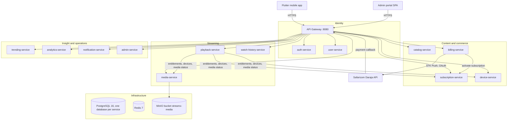

# StreamX: Microservices Video Streaming Platform


**StreamX** is a Netflix-style video streaming platform made of Java 24 / Spring Boot 3.4 microservices, a React + TypeScript admin portal, and a Flutter mobile app for Android and iOS.

Admins upload movies, episodes, trailers, posters and backdrops (or paste links), the media service stores them in MinIO and transcodes video to adaptive HLS, and subscribers pay with M-Pesa STK Push and watch in a full-screen mobile player with resume, skip, and next-episode autoplay.

Every screen in the admin portal and the mobile app reads live data from the API. There is no mock, sample or optimistic data anywhere. Features whose provider is not configured (M-Pesa, SMTP) fail honestly with a clear error instead of pretending to succeed.

Production:

- API gateway: `https://streamxapi.briankimathi.dev/api/v1`
- Admin portal: `https://streamxadmin.briankimathi.dev`

---

## Monorepo Layout

```
streaming-system/
|-- apps/
|   |-- admin/                  Admin portal SPA (Vite 6, React 18, TypeScript, Tailwind, hls.js)
|   `-- mobile/                 Subscriber app (Flutter 3.38, Android + iOS), see apps/mobile/README.md
|-- backend/
|   |-- api-gateway/            Spring Cloud Gateway, JWT filter, routing, CORS (8080)
|   |-- auth-service/           Accounts, JWTs, refresh tokens, admin bootstrap (8081)
|   |-- user-service/           Profiles, Kids mode, 4-digit PIN, profile tokens (8082)
|   |-- catalog-service/        Movies, TV shows, seasons, episodes, genres, watchlist (8083)
|   |-- subscription-service/   Plans, plan versions, subscriptions, entitlements (8084)
|   |-- billing-service/        M-Pesa STK Push checkout, callbacks, refunds, M-Pesa settings (8085)
|   |-- device-service/         Device registration and device limits (8086)
|   |-- media-service/          MinIO uploads, link imports, FFmpeg HLS transcoding, streaming (8087)
|   |-- playback-service/       Playback authorization, stream tokens, concurrent stream limits (8088)
|   |-- watch-history-service/  Per-profile progress and Continue Watching (8089)
|   |-- trending-service/       Velocity-based trending scores (8090)
|   |-- analytics-service/      Live aggregation of users, watch time and revenue (8091)
|   |-- notification-service/   Email (SMTP) and in-app notifications (8092)
|   |-- admin-service/          Audit log, feature flags, incidents, tickets, platform health (8093)
|   |-- common/                 Shared DTOs (ApiResponse), JWT utilities, enums, exceptions
|   |-- k8s/                    Kubernetes manifests (see the Kubernetes section)
|   |-- scripts/init-db.sql     Creates one PostgreSQL database per service
|   |-- docker-compose.yml      Full stack: PostgreSQL, Redis, MinIO, all services, admin portal
|   `-- .env.example            Every deployment variable, documented
`-- .github/workflows/          CI (ci-cd.yml) and SSH deploy (deploy.yml)
```

---

## Architecture



Services talk to each other over internal HTTP endpoints (`/api/v1/{service}/internal/**`). The gateway answers 404 for every internal path, so they are only reachable inside the Docker network.

---

## Security Model

- **Gateway JWT filter.** Every request except an explicit allow-list of public routes (sign-in, sign-up, refresh, the published catalog, the M-Pesa callback, public media files, HLS streams) needs a valid access token. The gateway strips client-supplied `X-User-*` headers and re-adds identity headers from the verified token, so services never trust spoofed identity.
- **Admin routes.** `/api/v1/{service}/admin/**` requires an admin role in the token. The admin account is created or updated on auth-service startup from `ADMIN_EMAIL` / `ADMIN_PASSWORD`; there is no self-service admin sign-up.
- **Profile tokens.** After choosing a profile the mobile app carries a profile-scoped token, so watch history, My List and maturity limits are enforced per profile.
- **Stream tokens.** `POST /playback/request` checks the subscription, the registered device and the concurrent stream limit, then returns a short-lived JWT of type `stream` bound to one title. The HLS URL embeds it: `/api/v1/media/stream/{token}/{contentId}/{file}`. A token for one title cannot open another.
- **Server-side truth.** Prices, plan limits, roles and ids are never taken from the client. Checkout reads the price from the plan; entitlements come from subscription-service.
- **Secrets.** No secret is committed or shipped to the admin bundle. M-Pesa credentials saved from the admin panel are encrypted at rest (AES-256-GCM) and only ever returned masked.

### Admin roles

Defined in `common` (`AdminRole`): `SUPER_ADMIN`, `ADMIN`, `CONTENT_MANAGER`, `FINANCE_MANAGER`, `SUPPORT_AGENT`, `MODERATOR`, `ANALYST`. Every admin mutation is written to the admin-service audit log with the admin's id, email, role, action, target and reason.

---

## Media Pipeline (MinIO + FFmpeg + HLS)

All media lives in one private MinIO bucket, `streamx-media`:

| Key prefix | Contents |
| :--- | :--- |
| `uploads/` | In-progress chunked uploads |
| `originals/{contentId}/` | Original video files |
| `hls/{contentId}/` | `master.m3u8`, variant playlists and `.ts` segments |
| `files/{fileId}/{filename}` | Posters, backdrops, thumbnails and trailers |

**Uploads.** The admin portal uploads any file in 32 MiB parts, which keeps each request under Cloudflare's 100 MB body limit and lets multi-gigabyte movies upload reliably:

1. `POST /media/admin/uploads` opens a session (kind `VIDEO`, `TRAILER` or `IMAGE`, size limits checked up front).
2. `PUT /media/admin/uploads/{id}/parts/{n}` streams each part straight to MinIO.
3. `POST /media/admin/uploads/{id}/complete` assembles the object. Images and trailers return a public URL immediately; videos start an FFmpeg transcode in the background.
4. `DELETE /media/admin/uploads/{id}` aborts and cleans up.

**Links.** Instead of uploading, an admin can paste a link. For artwork and trailers the link is stored as-is. For videos, `POST /media/admin/imports` downloads a direct file link (http/https, with an SSRF guard that refuses private, loopback and metadata addresses) into MinIO and transcodes it.

**Transcoding.** FFmpeg produces 1080p, 720p and 480p H.264 renditions (never upscaled) plus a master playlist. The admin Media Pipeline page shows progress and failure reasons, and an admin preview endpoint returns a short-lived stream URL so the built-in hls.js player can check the result before publishing.

**Delivery.**

- Video: `GET /api/v1/media/stream/{token}/{contentId}/{file}`, served from MinIO and authorized by the stream token.
- Artwork and trailers: `GET /api/v1/media/files/{fileId}/{filename}`, public, with `Range` support (206), `ETag`, and immutable caching so Cloudflare and the apps cache them.

---

## Admin Portal (`apps/admin`)

- **Dashboard** with live counts from the services (no placeholder stats).
- **Catalog.** Create, edit and publish movies and TV shows. Each asset field (video, trailer, poster, backdrop, episode thumbnail) accepts either an upload with a progress bar or a link. Seasons and episodes are managed per show, each episode with its own video. Navigating away during an upload asks for confirmation.
- **Media Pipeline.** Transcode jobs, status, errors, and an HLS preview player.
- **Plans and subscriptions.** Data-driven plans with immutable versions (price, max resolution, streams, devices, profiles).
- **Payments (M-Pesa).** Under Settings, enter the Daraja consumer key and secret, shortcode, passkey, environment (sandbox or production) and transaction type. Secrets are write-only and shown masked. A **Test connection** button requests a Daraja OAuth token without charging anyone. Values saved here override the `MPESA_*` environment variables field by field, and clearing them falls back to the environment.
- **Billing.** Transactions, statuses, M-Pesa receipt numbers and reason-based refunds.
- **Accounts, devices, notifications, tickets, incidents, feature flags, audit log and platform health.**

Run it locally:

```bash
cd apps/admin
npm install
npm run dev          # Vite dev server
npm run build        # production build
```

---

## Mobile App (`apps/mobile`)

The Flutter app covers the whole subscriber journey against the live API: sign up and sign in, profile picker with Kids mode and PIN, home rows (Continue Watching, Trending, New, TV Shows, genres), search, title details with trailer, seasons and episodes, My List, plans, M-Pesa checkout, billing history, devices, notifications and settings.

The player behaves like a streaming service player:

- Opens in landscape full screen and returns to portrait on exit.
- Play and pause, 10 second back and forward buttons, and double-tap seeking that accumulates (+10, +20, +30 s).
- Scrubber with buffered range, playback speed, and screen lock.
- Episodes panel with season switcher, a "Next Episode" button, a "Next Episode" pill in the last 20 seconds, and a 5 second autoplay countdown when the episode ends.
- Resumes from the saved position and syncs progress to watch-history-service.

See [`apps/mobile/README.md`](apps/mobile/README.md) for build options, the checkout flow and session handling.

```bash
cd apps/mobile
flutter pub get
flutter run                                   # production API
flutter run --dart-define=API_BASE_URL=http://10.0.2.2:8080/api/v1   # local gateway from the Android emulator
flutter test
```

---

## Payments: M-Pesa STK Push

1. The app calls `POST /billing/checkout {planId, phoneNumber}`. billing-service reads the price from the plan and sends an STK Push through Daraja.
2. The subscriber enters their M-Pesa PIN on their phone.
3. Safaricom calls `MPESA_CALLBACK_BASE_URL/{MPESA_CALLBACK_TOKEN}`. The callback route is public, so the random token in the path authenticates it.
4. On success the transaction is marked `COMPLETED` with the receipt number and the subscription is activated. The app polls the transaction until it settles.

Free plans activate directly without a payment. Without credentials (neither admin settings nor environment), checkout returns 503 "M-Pesa payments are not configured".

Sandbox credentials come from [developer.safaricom.co.ke](https://developer.safaricom.co.ke) (shortcode 174379 with its test passkey).

---

## Other Platform Features

- **Profile-centric watch history.** Progress is stored per profile, so a title paused on one device resumes at the same second on another. Titles count as completed at 90 percent.
- **Velocity-based trending.** `Score = 5 x views(1h) + 3 x views(6h) + 2 x completions(24h) + 1 x likes(24h)`.
- **Entitlements and plan versioning.** Playback checks `max_concurrent_streams`, `max_registered_devices` and maximum resolution from the subscriber's plan version; editing a plan does not change existing subscribers' terms.
- **Java 24 without Lombok.** Plain constructors, getters and setters, SLF4J logging, and an `ApiResponse` wrapper on every endpoint.

---

## Configuration

Copy `backend/.env.example` to `backend/.env` (git-ignored) and fill it in. The main variables:

| Variable | Required | Purpose |
| :--- | :--- | :--- |
| `JWT_SECRET` | Yes | Signs access, profile and stream tokens. `openssl rand -hex 64` |
| `ADMIN_EMAIL`, `ADMIN_PASSWORD` | Yes | Admin account created or updated on startup (password at least 12 characters) |
| `POSTGRES_USER`, `POSTGRES_PASSWORD` | Yes | Must match the existing data volume |
| `MINIO_ROOT_USER`, `MINIO_ROOT_PASSWORD` | Yes | MinIO credentials, also used by media-service. `openssl rand -hex 24` |
| `SETTINGS_ENCRYPTION_KEY` | Recommended | Encrypts M-Pesa credentials saved from the admin panel. `openssl rand -hex 32`. Falls back to a key derived from `JWT_SECRET` |
| `MPESA_ENVIRONMENT`, `MPESA_CONSUMER_KEY`, `MPESA_CONSUMER_SECRET`, `MPESA_SHORTCODE`, `MPESA_PASSKEY`, `MPESA_TRANSACTION_TYPE` | Optional | Daraja credentials. The admin panel can set them instead |
| `MPESA_CALLBACK_TOKEN` | With M-Pesa | Random secret in the callback URL. `openssl rand -hex 24` |
| `MPESA_CALLBACK_BASE_URL` | Optional | Defaults to the production callback URL |
| `MEDIA_PUBLIC_BASE_URL` | Optional | Public origin used in file URLs. Defaults to the production API host |
| `SMTP_HOST`, `SMTP_PORT`, `SMTP_USERNAME`, `SMTP_PASSWORD`, `MAIL_FROM` | Optional | Email delivery. Without SMTP, email sends are recorded as `FAILED` |
| `MEDIA_MAX_VIDEO_BYTES`, `MEDIA_MAX_TRAILER_BYTES`, `MEDIA_MAX_IMAGE_BYTES` | Optional | Upload size limits (defaults 20 GiB, 2 GiB, 20 MiB) |
| `MEDIA_TRANSCODE_THREADS`, `DB_POOL_SIZE`, `MEDIA_JAVA_OPTS` | Optional | Tuning for small hosts |

Do not change `SETTINGS_ENCRYPTION_KEY` after credentials have been saved in the admin panel; they can no longer be decrypted and must be entered again.

---

## Local Development

Prerequisites: JDK 24, Maven 3.9+, Node.js 20+, Flutter 3.38+, Docker with Compose.

```bash
# Backend unit tests (all modules)
cd backend
mvn clean test

# Full stack: PostgreSQL, Redis, MinIO, all services and the admin portal
cp .env.example .env     # then fill in the required values
docker compose up --build -d
```

All ports are bound to `127.0.0.1` only:

| Service | Host port |
| :--- | :--- |
| API gateway | `9080` |
| Admin portal | `9090` |
| MinIO console | `19001` |
| PostgreSQL | `5434` |
| Redis | `6380` |
| Individual services | `18081` to `18093` |

---

## Production Deployment

Production runs the Docker Compose stack on a single host (`kim`) behind nginx and Cloudflare (proxied). nginx forwards `streamxapi.briankimathi.dev` to the gateway on port 9080 and `streamxadmin.briankimathi.dev` to the admin portal on port 9090. The deployment lives in `~/deployments/streaming-system`, with secrets in `backend/.env` on the server only.

```bash
cd ~/deployments/streaming-system/backend
docker compose up --build -d
docker compose ps
```

`.github/workflows/deploy.yml` does the same over SSH on every push to `main` when the `SSH_HOST`, `SSH_USER` and `SSH_PRIVATE_KEY` repository secrets are set. It runs `git pull`, so the server directory must be a git checkout for that workflow to work.

**MinIO console.** The console is not exposed publicly. Open an SSH tunnel and browse to `http://localhost:19001` with the `MINIO_ROOT_USER` / `MINIO_ROOT_PASSWORD` credentials:

```bash
ssh -L 19001:127.0.0.1:19001 kim
```

MinIO runs the community-maintained `pgsty/minio` image, because the official `minio/minio` images are no longer published to Docker Hub or Quay.

---

## Known Limitations

- **Transcoding speed.** On a 2 CPU host, transcoding runs at roughly real time (a 2 hour movie takes about 2 hours before it can be published). Uploading is not the bottleneck.
- **Video links must be direct files.** Links to pages (YouTube, Google Drive viewers and similar) cannot be imported as videos. Trailer links to such pages are kept and open externally in the app.
- **Trailer format.** Uploaded trailers are served as-is, so use MP4 (H.264/AAC) for playback on every device.
- **No delete in the admin UI.** Movies and shows can be edited or unpublished from the portal. Delete endpoints exist (`DELETE /catalog/admin/movies/{id}`, `DELETE /catalog/admin/tv-shows/{id}`) but have no button yet.
- **Mobile player testing.** The player has unit tests for its logic but has not yet been exercised on a physical device. iOS builds need a Mac.

---

## Kubernetes

`backend/k8s/` contains manifests for a namespace, config and secrets, PostgreSQL, Redis, Kafka, the microservices and an NGINX ingress. They predate MinIO, the M-Pesa settings and the admin portal container, and still include Kafka, which the services no longer use. Docker Compose is the maintained deployment path; update the manifests before using them.

```bash
kubectl apply -f backend/k8s/
kubectl get pods -n streamx --watch
```

---

## CI/CD

- `.github/workflows/ci-cd.yml` builds and tests the Java modules with JDK 24, builds the admin portal, builds the container images and validates the Kubernetes manifests on pushes and pull requests to `main`.
- `.github/workflows/deploy.yml` deploys to the production host over SSH (see Production Deployment).

---

## License

Distributed under the MIT License.
